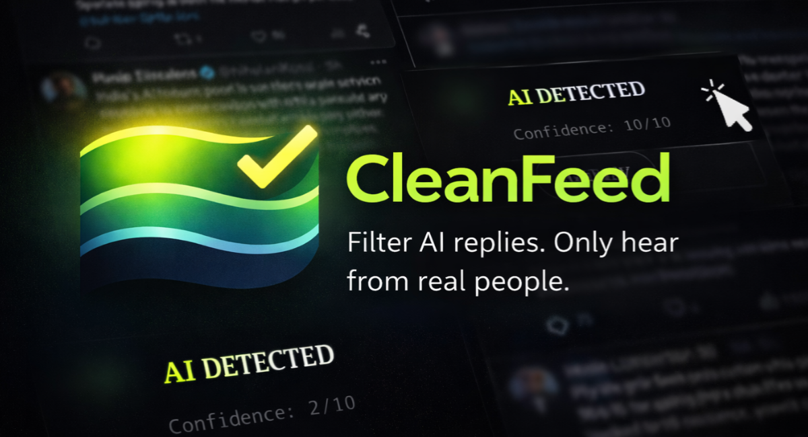

# :shield: CleanFeed - AI Reply Filter for X

> :rocket: **Coming soon to the Chrome Web Store!**

**CleanFeed** is a Chrome Extension that automatically detects and hides AI-generated replies (LLM slop) on X (formerly Twitter). It uses advanced detection to keep your timeline human-centric, applying a beautiful glassmorphism blur to suspected AI content.

## :sparkles: Features

- **:robot: Real-time Detection:** Automatically scans new tweets as you scroll using the MutationObserver API.
- **:gem: Glassmorphism UI:** Blurs AI tweets with a modern, dark-mode friendly frosted glass overlay.
- **:zap: Smart Caching:** Remembers analyzed tweets to prevent API spam and "flickering" when scrolling up/down.
- **:control_knobs: Adjustable Sensitivity:** Use the slider to choose between Aggressive (catch everything) or Strict (high confidence only) filtering.
- **:electric_plug: Master Switch:** Instantly toggle the extension on/off without reloading the page.
- **:lock: Privacy Focused:** Only analyzes tweet text. Does not run on DMs, Settings, or Compose pages.

## :computer: Installation (Developer Mode)

Since the extension is currently in **Beta** and not yet live on the Store, you can install it manually:

1. **Clone or Download** this repository.
2. Open Google Chrome and navigate to `chrome://extensions`.
3. Toggle **Developer mode** in the top right corner.
4. Click **Load unpacked**.
5. Select the folder containing these files.

## :gear: Configuration

1. **Get your API Token:**
   Sign up at [**cleanfeed.social**](https://cleanfeed.social) to generate your API key.
2. **Open the Extension:**
   Click the CleanFeed logo in your browser toolbar.
3. **Enter Credentials:**
   Paste your Token into the input field.
4. **Test & Save:**
   Click "Test" to verify connectivity, then "Save".

## :file_folder: Project Structure

- **`manifest.json`** - Extension configuration (Manifest V3).
- **`background.js`** - Service worker that handles API requests.
- **`content_isolated.js`** - The core logic (DOM observation, UI injection, caching).
- **`popup.html` / `popup.js`** - The settings UI with the neon dark theme and slider controls.
- **`icons/`** - Application icons.

## :lock: Privacy & Permissions

This extension requires the following permissions:
- `storage`: To save your API token and preferences locally.
- `host_permissions`: To analyze text on `twitter.com` and `x.com`.

**Note:** The extension sends the text of tweets found on your timeline to the configured API endpoint for analysis. No personal user data (cookies, session IDs) is collected or sent.

## :scroll: License

This project is licensed under the MIT License.